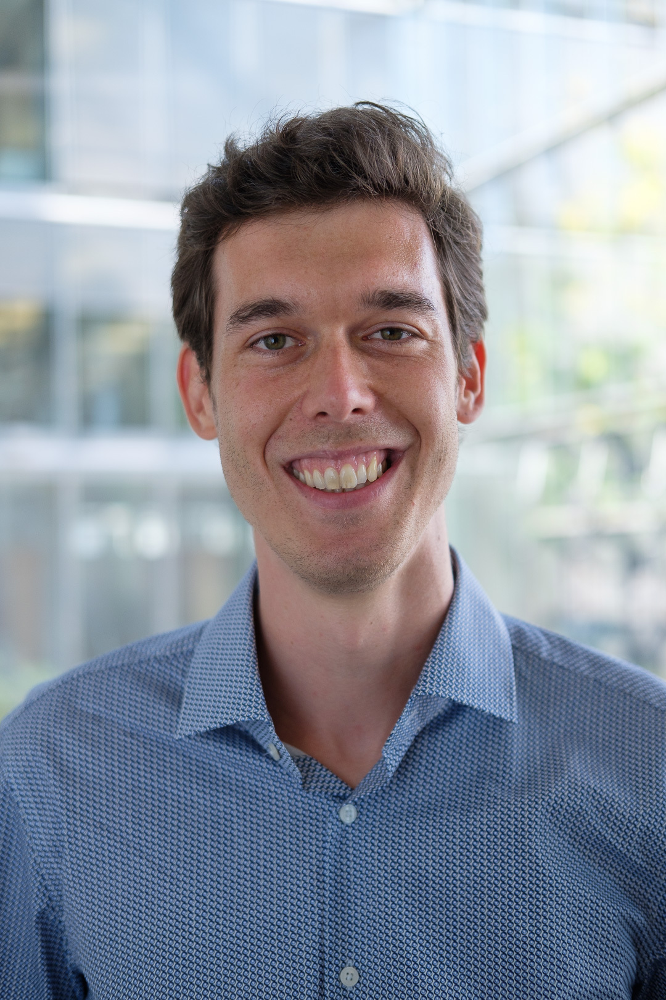
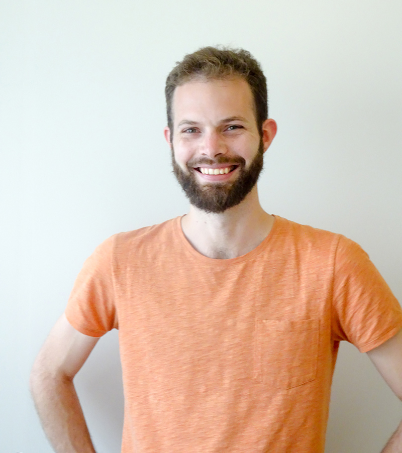
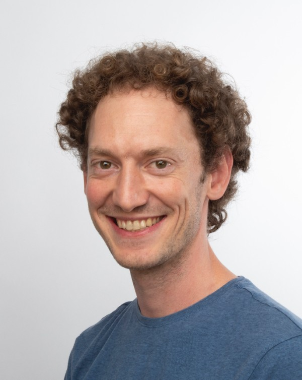
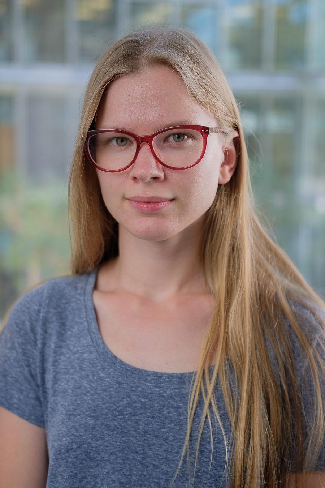

_In 1950, Alan Turing proposed his famous test to distinguish humans from machines. At the time, he probably didn't think workshop participants would attempt to beat his test with billion parameter models in real-time. But here we are!

This tutorial has two parts: In the first half, we will take a deep dive into conversational AI. By mastering a series of small tasks, you will discover what makes state-of-the-art models like GPT-3 so powerful and how you can build your own models.

In the second half, we will run a challenge in which you will work on building the most life-like bot possible and test it in a real-life setting. You will also have the chance to evaluate other participants’ bots - but with a twist! Every now and then you will actually chat with a real human. Will you be able to tell?_

# Organizers
|                 | **Martin Müller, EPFL, martin.muller@epfl.ch**                                                                                                                                                                                                                                                                                                                                                                                                     |
|-----------------|----------------------------------------------------------------------------------------------------------------------------------------------------------------------------------------------------------------------------------------------------------------------------------------------------------------------------------------------------------------------------------------------------------------------------------------------------|
|  | Martin Müller holds a master's degree in Computational Biology & Bioinformatics from ETH Zurich and is currently a PhD candidate at the Digital Epidemiology Lab at EPFL. In his work he focuses on applied machine learning systems for Health and Epidemiology in the context of real-time social media data streams. He was part of the team that held the previous version of the proposed workshop at the Applied Machine Learning Days 2020. |

|                  | **Florian Laurent, AIcrowd, florian.laurent@gmail.com**                                                                                                                                                                                                                                                                                                                                                                                                                                                                                                                                                                                                                                                                  |
|------------------|--------------------------------------------------------------------------------------------------------------------------------------------------------------------------------------------------------------------------------------------------------------------------------------------------------------------------------------------------------------------------------------------------------------------------------------------------------------------------------------------------------------------------------------------------------------------------------------------------------------------------------------------------------------------------------------------------------------------------|
|  | Florian Laurent holds a Master's degree in Computer Science from EPFL and currently works as a Machine Learning engineer at AIcrowd. He has been organizing large-scale ML challenges for the past 2 years, working in areas such as reinforcement learning, adversarial vision and traffic planning. He’s also involved in natural language generation research as part of a commercial project. He has presented multiple reinforcement learning workshops and was part of the team that held the previous version of the proposed workshop at the Applied Machine Learning Days 2020. He has already organized workshops which involve competitions, a method which has proven very efficient to engage participants. |

|                  | **Manuel Schneider, ETH Zürich, manuel.schneider@hest.ethz.ch**                                                                                                                                                                                                                                                                                                                                                                                                                                                                                                                                                                                                 |
|------------------|-----------------------------------------------------------------------------------------------------------------------------------------------------------------------------------------------------------------------------------------------------------------------------------------------------------------------------------------------------------------------------------------------------------------------------------------------------------------------------------------------------------------------------------------------------------------------------------------------------------------------------------------------------------------|
|  | Manuel Schneider holds a master's degree in theoretical physics and is currently a PhD candidate at the Institute of Translational Medicine at ETH Zurich. He develops computational methods for digital bioethics research which includes the use of machine learning approaches to natural language processing for discourse and policy analysis. During the course of his PhD, he was teaching the basics and application of computational methods to intermediate expert audiences, was presenting as a speaker at conferences, and was part of the team that held the previous version of the proposed workshop at the Applied Machine Learning Days 2020. |

|                 | **Olesia Altunina, EPFL, olesia.altunina@epfl.ch**                                                                                                                                                                                                                                                                                                                                                                                                 |
|-----------------|----------------------------------------------------------------------------------------------------------------------------------------------------------------------------------------------------------------------------------------------------------------------------------------------------------------------------------------------------------------------------------------------------------------------------------------------------|
|  | Olesia Altunina is a research engineer at the Digital Epidemiology Lab at EPFL where she's developing natural language processing pipelines for real-time social media monitoring. During her work in industry and her master's studies in Neuroscience at EPFL she was able to develop a broad understanding of reinforcement learning and techniques in computer vision. She has participated in various teaching activities during her studies. |

# Topic and relevance

Our tutorial focuses on the topic of conversational AI, specifically how state-of-the-art machine learning models for natural language processing work, how they can be used for text generation, and how to employ text generation techniques to build a conversational system. While we will introduce the concepts and theoretical background used for conversational AI, we will not give a complete introduction to natural language processing. Our emphasis is on acquiring skills that allow participants to implement a real-world conversational system.
 
Arguably one of the key drivers for the adoption of the internet has been interaction with other humans, be it through email, messaging platforms or social media. Interactions with computers, such as search engines, have become much easier compared to the early days of the internet. Chatbots and dialogue systems are becoming increasingly integrated into modern online platforms. However, even today, conversations are often clumsy and inefficient, especially when the conversations go beyond a simple Siri command. And although for most people knowing “how to google" and navigating the complex user interfaces of websites is now part of their core digital skillset, there is an abundance of people with visual or other impairments, who greatly struggle with such tasks. Improving conversational AI is therefore an important direction also for improving accessibility and democratization of the web.
 
Passing the Turing test has been considered as the holy grail for artificial intelligence. It has also drawn a lot of criticism and its relevance has been questioned by both philosophers and AI researchers. Undoubtedly, the strengths of this test lies in its simplicity and the pragmatic approach to very complex philosophical questions. Our workshop will not aim to give a resolution to these questions, but it might be able to give an idea for how far conversational AI has come, and exactly what we as humans seek out for in conversations with computers. 
 
For the above reasons, we believe it is relevant to the Web Conferences audience to understand the current state of conversational AIs and their inner workings, as well as to learn what it takes to develop and how to implement such conversational systems. We, the presenters of this tutorial, have all worked with machine learning and natural language processing, in particular also with generative text models, as part of our professional work. In addition, we have all experience in teaching and organising workshops similar to the proposed tutorial both in person and virtually, and have already held a previous version of this tutorial which was very well received.

# Duration

We propose a full-day tutorial to allow the participants not just to learn about the basics of state-of-the-art language models but also to acquire skills to apply that knowledge in a real-world scenario. For that, our tutorial emphasizes the hands-on work on a series of small tasks with gradually increasing difficulty in the first part of the workshop and solving an open problem statement in the second half of the tutorial. This problem-based approach requires time but gives participants the possibility to engage with the topic and solidify their understanding of the subject and their acquired skills through an immersive learning experience.

# Interaction style

Our tutorial consists of presentations by the tutorial team, individual work by the participants to apply the content of the presentations in a guided task following each presentation, as well as a competition part where participants can work alone or in groups on a complex problem and interact with the tutorial team for support, questions and inputs.
This complex problem will be an online competition in which participants will attempt to train the most life-like conversational agents they can. Other participants will then evaluate which agents are closest to a human interlocutor. At the end of the workshop, winners will be announced and they will be encouraged to share their results and methods to other participants.

# Intended audience and level

The tutorial is designed for participants interested in the topic of generative language models. No prior knowledge of machine learning is required but participants should be familiar with Python (intermediate skill level). Participants will learn the nuts and bolts of building an open domain chat bot. We will attempt to dive relatively deep in the self-attention mechanisms of large transformer models but also focus on the practical aspects of language model finetuning. During the challenge, participants will be faced with the difficulties of evaluating language models properly and learn how to integrate their models in actual applications.

# Tutorial materials

We will provide participants with the presentation slides, multiple Colab notebooks for the individual work, and a github repository with additional information and explanations. Additional reading material we intend to use is all open access. All the material created for the purpose of this tutorial will be released under an open license.

# Online format

Although the previous version of this tutorial was done in person, we already put emphasis on enabling the participants to work and learn at their own speed, resulting in a setup that is easily transferable to a virtual space. The main part of our tutorial consists of participants working individually on tasks and problems. We provide detailed instructions and explanations for all tasks such that they can be completed without interaction necessary. Nevertheless, for the duration of the whole tutorial, we will use Gitter (https://gitter.im) to be able to interact with each other and to ask questions. The presentations as well as the instructions (in addition to providing them in written form) for all tutorial parts will be given through video conferencing, where participants also have the possibility to ask questions. We are aware of the challenges of virtual-only formats and have made experiences with similar formats to this proposal through virtual teaching activities and virtual workshops we organized during this year. In our experience, the key lies in the detailed planning and rigorous preparation of the tutorial to provide a self-explanatory virtual learning environment.

# Additional info for hands-on tutorials

## Tutorial duration
6 hours
## Operating system and required installed tools on attendees’ devices
No tools are required for the tutorial since it can all be done through Google Colab notebooks.
## Setup instructions for attendees
No setup is required, but using Google Colab requires a Google account. However, we will provide instructions on how to locally install the source code used in the tutorial if desired.
